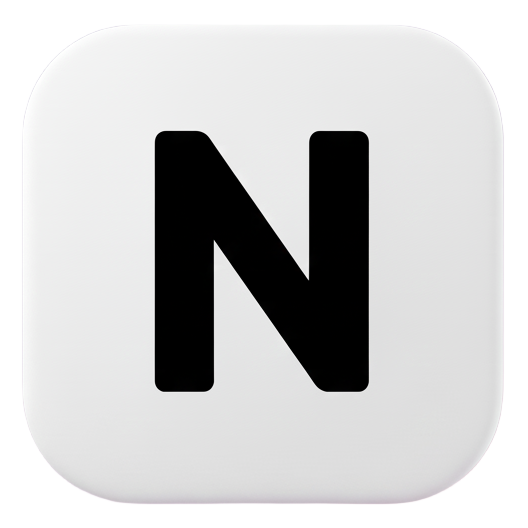

# Flutter News App

A fast, minimal, and modern news reader built with Flutter and powered by NewsAPI.

[](https://flutter.dev)


## Overview

This app shows top headlines by category and supports full-text search across articles. It uses:

- dio for HTTP
- cached_network_image for image caching
- webview_flutter to open full articles
- Custom UI widgets for a smooth, animated experience

Dark theme is enabled by default.

## Features

- Browse top headlines by category (e.g., business, sports, tech)
- Search news by keyword
- Smooth image loading with caching
- In-app article viewing (WebView)
- Mobile-first with support for Android, iOS, Web, and Desktop

## Demo


## Screenshots

<p>
	
	
	
  
</p>

## Tech Stack

- Flutter 3.x, Dart (SDK ^3.8.1)
- Packages: dio, cached_network_image, webview_flutter, url_launcher, google_fonts

## Architecture

- `lib/services/` — API services (NewsAPI integration via `NewsApiService`)
- `lib/modules/` — Data models (`ArticleModel`, `FullArticelsModel`)
- `lib/screens/` — UI screens and views
- `lib/widgets/` — Reusable components (e.g., animated tabs, swipeable stack)

Data flow:

1. `NewsApiService` fetches JSON using dio
2. Responses are parsed into models
3. Screens render lists/cards and open details in a WebView

## Project Structure

```
lib/
	main.dart
	modules/
		article.module.dart
	screens/
		views/
		widgets/
	services/
		news_api.service.dart
	widgets/
		animated_tab_selector.dart
		swipeable_stack.dart
assets/
	images/
```


## Acknowledgements

- News data from NewsAPI.org
- Flutter and the Dart team

