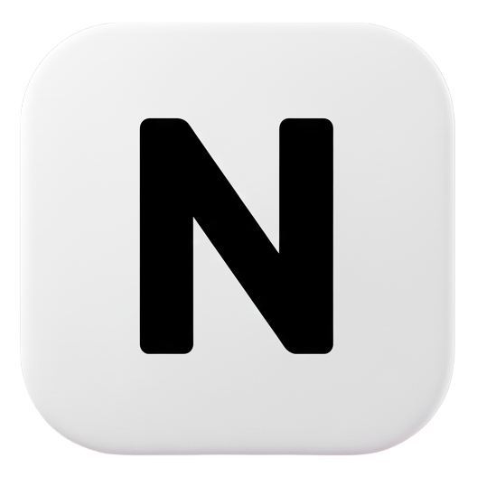
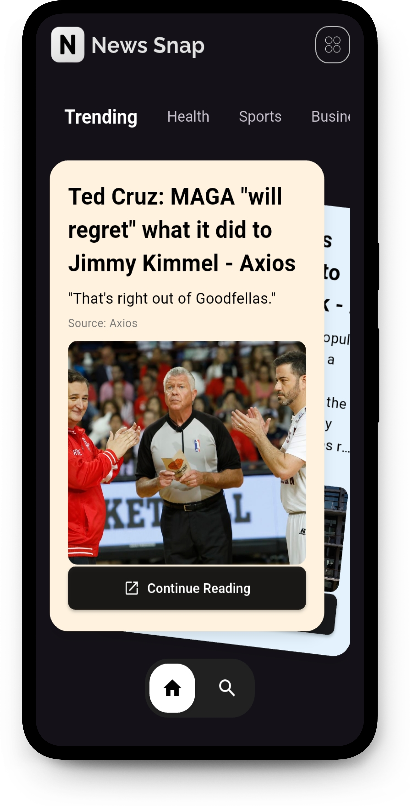
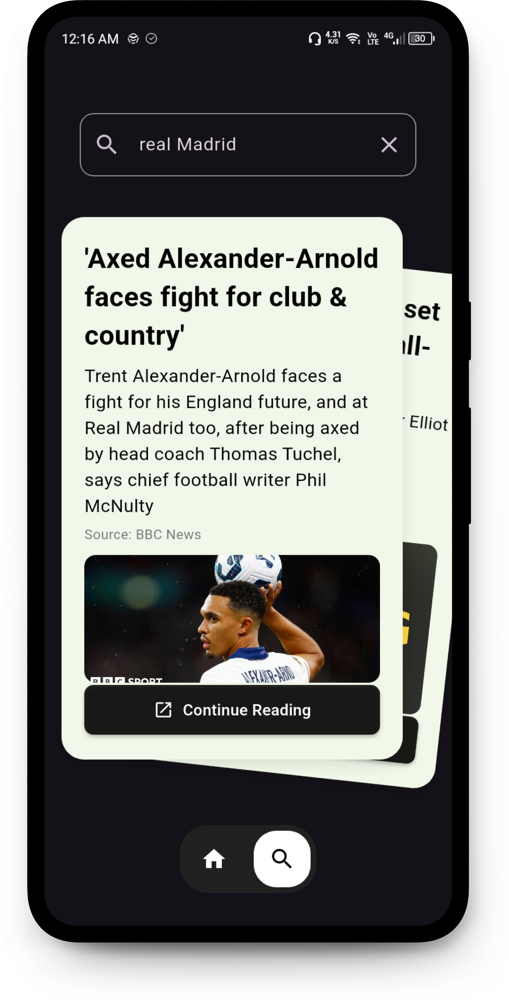

# News Snap

<p align="center">
  
</p>

<p align="center">
  <b>Headlines, fast.</b><br/>
  A dark, minimal Flutter news reader powered by NewsAPI — category feeds, keyword search, and in-app article viewing.
</p>

<p align="center">
  
  
  
  
  
</p>

---

## Why this exists

Most news apps drown you in chrome. News Snap keeps the loop tight:

**Pick a category → swipe through stories → open the full article in-app.**

Built to show clean Flutter UI craft: custom motion widgets, cached imagery, Dio networking, and a clear services → models → screens split.

## Features

| Area | What you get |
|------|----------------|
| Headlines | Top stories by category via NewsAPI |
| Categories | General · Health · Sports · Business |
| Search | Full-text keyword search across articles |
| Reading | In-app WebView for full articles |
| Motion UI | Custom `AnimatedTabSelector` + `SwipeableStack` |
| Imagery | Smooth loading with `cached_network_image` |
| Theme | Dark mode by default |
| Platforms | Android, iOS, Web, Desktop |

## User flow

```text
Launch (dark splash)
  → Home: category tabs + swipeable news cards
  → Tap card → WebView article
  → Search tab → keyword query → results
  → Drawer / settings entry points
```

## Demo


## Screenshots

<p>
  
  
  
</p>

## Architecture

```text
┌─────────────────┐     ┌──────────────────┐     ┌─────────────────────┐
│  Screens / UI   │ ──▶ │  Services        │ ──▶ │  NewsAPI (REST)     │
│  views + widgets│     │  NewsApiService  │     │  top-headlines /    │
└─────────────────┘     └──────────────────┘     │  everything         │
         │                       │               └─────────────────────┘
         │                       ▼
         │              ArticleModel DTOs
         ▼
   Custom widgets (tabs, swipe stack) + WebView
```

**Data flow**
1. `NewsApiService` fetches JSON with Dio
2. Responses map into `ArticleModel` / `FullArticelsModel`
3. Builders render card stacks; taps open `WebViewScreen`

## Project structure

```text
lib/
├── main.dart                      # Dark MaterialApp bootstrap
├── modules/
│   └── article.module.dart        # Article · Source · response wrapper
├── services/
│   └── news_api.service.dart      # Category headlines + search
├── screens/
│   ├── views/
│   │   ├── main_view.dart         # Shell + animated tab nav
│   │   ├── home.view.dart         # Category tabs + feeds
│   │   ├── search_view.dart       # Keyword search
│   │   └── webview_screen.dart    # In-app article reader
│   └── widgets/                   # App bar, cards, drawer, tabs
└── widgets/
    ├── animated_tab_selector.dart # Reusable motion tab bar
    └── swipeable_stack.dart       # Gesture-driven card stack

assets/images/                     # Logo + branding
showcase/                          # Screenshots + demo GIF
```

## Tech stack

| Layer | Choice |
|-------|--------|
| Framework | Flutter · Dart `^3.8.1` |
| Networking | `dio` → NewsAPI (`top-headlines`, `everything`) |
| Images | `cached_network_image` |
| Reading | `webview_flutter` · `url_launcher` |
| Typography | `google_fonts` |
| Branding | `flutter_native_splash` · `flutter_launcher_icons` |

Full list: [`pubspec.yaml`](pubspec.yaml)

## Custom widgets

Reusable pieces living in `lib/widgets/` — extractable into other projects.

### AnimatedTabSelector
Smooth circular indicator over a compact icon bar. Configurable colors, sizes, duration, and curves.

### SwipeableStack
Physics-y card stack: drag, throw, rotate, advance. Configurable offset and rotation for the back card.

## Getting started

**Prerequisites**
- Flutter SDK (Dart 3.8+)
- A [NewsAPI.org](https://newsapi.org) API key

```bash
git clone https://github.com/baraa404/News-Snap.git
cd News-Snap
flutter pub get
```

Put your NewsAPI key in `lib/services/news_api.service.dart` (or ideally an env/`--dart-define` — don’t commit secrets to public forks).

**Run**

```bash
flutter devices
flutter run -d android   # or ios / chrome / linux / macos / windows
```

## Useful commands

```bash
flutter clean && flutter pub get
flutter analyze
flutter test
```

## Notes for reviewers

- Package name is `news_app`; product branding is **News Snap**.
- NewsAPI free-tier keys are meant for development; production needs a proper key + backend proxy.
- Prefer HTTPS article URLs for iOS App Transport Security.

## Acknowledgements

- News data from [NewsAPI.org](https://newsapi.org)
- Flutter & Dart teams

## License

MIT — portfolio / personal project.
