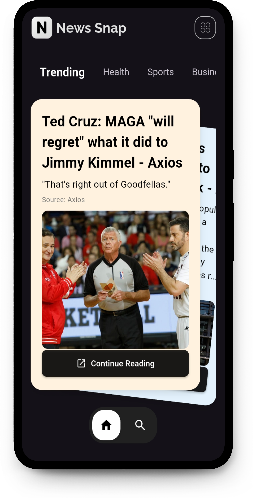

# Flutter News App

A fast, minimal, and modern news reader built with Flutter and powered by NewsAPI.

[](https://flutter.dev)


## Overview

This app shows top headlines by category and supports full-text search across articles. It uses:

- dio for HTTP
- cached_network_image for image caching
- webview_flutter to open full articles
- **Custom animated UI components** for smooth user interactions

Dark theme is enabled by default.

## Features

- Browse top headlines by category (e.g., business, sports, tech)
- Search news by keyword
- Smooth image loading with caching
- In-app article viewing (WebView)
- **Custom animated tab selector** with smooth transitions
- **Swipeable card stack** for interactive article browsing
- Mobile-first with support for Android, iOS, Web, and Desktop

## Demo


## Screenshots

<p>
	
	
	
  
</p>

## Tech Stack

- Flutter 3.x, Dart (SDK ^3.8.1)
- Packages: dio, cached_network_image, webview_flutter, url_launcher, google_fonts

## Architecture

- `lib/services/` — API services (NewsAPI integration via `NewsApiService`)
- `lib/modules/` — Data models (`ArticleModel`, `FullArticelsModel`)
- `lib/screens/` — UI screens and views
- `lib/widgets/` — Reusable components (e.g., animated tabs, swipeable stack)

Data flow:

1. `NewsApiService` fetches JSON using dio
2. Responses are parsed into models
3. Screens render lists/cards and open details in a WebView

## Custom Widgets

This project includes two powerful custom widgets that you can easily reuse in your own Flutter projects:

### 🎯 AnimatedTabSelector

A smooth, customizable tab selector with animated transitions between tabs.

**Features:**
- Smooth animated circle indicator
- Fully customizable colors, sizes, and animations
- Support for any number of tabs with icons
- Configurable animation duration and curves

**Usage:**
```dart
AnimatedTabSelector(
  icons: [Icons.home, Icons.search, Icons.settings],
  onTabSelected: (index) => print('Selected tab: $index'),
  backgroundColor: Colors.grey,
  circleColor: Colors.white,
  selectedIconColor: Colors.black,
  animationDuration: Duration(milliseconds: 300),
)
```

### 🃏 SwipeableStack

An interactive card stack widget with smooth swipe animations, perfect for card-based interfaces.

**Features:**
- Swipe cards left/right with gesture detection
- Smooth throw animations with physics
- Configurable stack offset and rotation
- Auto-advances to next card on swipe
- Infinite loop through card collection

**Usage:**
```dart
SwipeableStack(
  children: [
    Card(child: Text('Card 1')),
    Card(child: Text('Card 2')),
    Card(child: Text('Card 3')),
  ],
  animationDuration: Duration(milliseconds: 300),
  stackOffset: Offset(60, 25),
  rotationAngle: 0.11,
)
```

Both widgets are production-ready and can be extracted into your own projects by copying the files from `lib/widgets/`.

## Project Structure

```
lib/
	main.dart
	modules/
		article.module.dart
	screens/
		views/
		widgets/
	services/
		news_api.service.dart
	widgets/
		animated_tab_selector.dart
		swipeable_stack.dart
assets/
	images/
```


## Acknowledgements

- News data from NewsAPI.org
- Flutter and the Dart team

